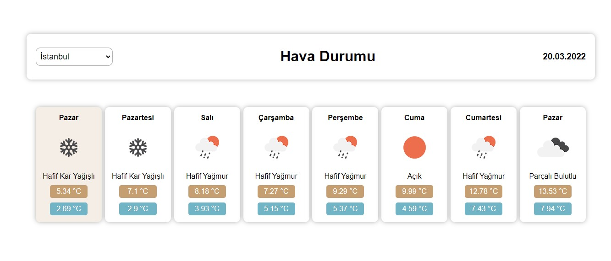

# Weather APP

https://api.openweathermap.org/ adresindeki API ile geliştirilmiştir. `APPID` ana dizindeki `.env` dosyasından geldiği için projeyi indirdiğinizde ana dizinde `.env` dosyasını oluşturup `REACT_APP_WEATHER_API_KEY=` içerisine kendi API anahtarınızı eklemelisiniz.

`npm start` ile çalıştırabilirsiniz.
 
